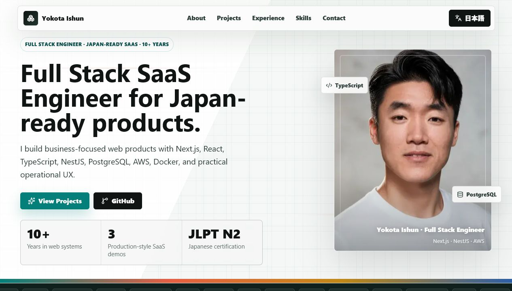

# Yokota Ishun Portfolio

Modern personal portfolio site for Yokota Ishun, a full stack SaaS engineer focused on Japan-ready business applications.

[Live Site](https://portfolio-dusky-alpha-95.vercel.app) · [GitHub](https://github.com/Yokota110/portfolio)



## Overview

This portfolio presents my work, technical strengths, and product experience through a polished bilingual interface. It highlights production-style SaaS projects, full stack engineering skills, and experience building practical workflows for inventory, reservation, recruiting, EC, DX, and AI/OCR integrations.

## Features

- Responsive portfolio built with Next.js App Router
- English and Japanese language toggle
- Animated hero section with refined portrait presentation
- Project cards with live demo and source links
- Experience, skills, and contact sections
- Privacy-conscious design with no resume download or personal PDF exposure

## Projects

| Project | Description | Links |
| --- | --- | --- |
| StockFlow AI | Inventory and stock workflow SaaS demo | [Live](https://stockflow-ai-web.vercel.app) · [Source](https://github.com/Yokota110/stockflow-ai) |
| TableBook AI | Restaurant reservation and table management SaaS demo | [Live](https://tablebook-ai.vercel.app) · [Source](https://github.com/Yokota110/tablebook-ai) |
| RecruitFlow AI | Recruiting workflow SaaS demo | [Live](https://recruitflow-ai-web.vercel.app) · [Source](https://github.com/Yokota110/recruitflow-ai) |

## Tech Stack

- Next.js 16
- React 19
- TypeScript
- Lucide React
- CSS animations and responsive layout
- Vercel deployment

## Getting Started

```bash
pnpm install
pnpm dev
```

Open [http://localhost:3000](http://localhost:3000) in your browser.

## Scripts

```bash
pnpm dev
pnpm build
pnpm start
pnpm typecheck
```

## Deployment

The site is deployed on Vercel:

[https://portfolio-dusky-alpha-95.vercel.app](https://portfolio-dusky-alpha-95.vercel.app)

